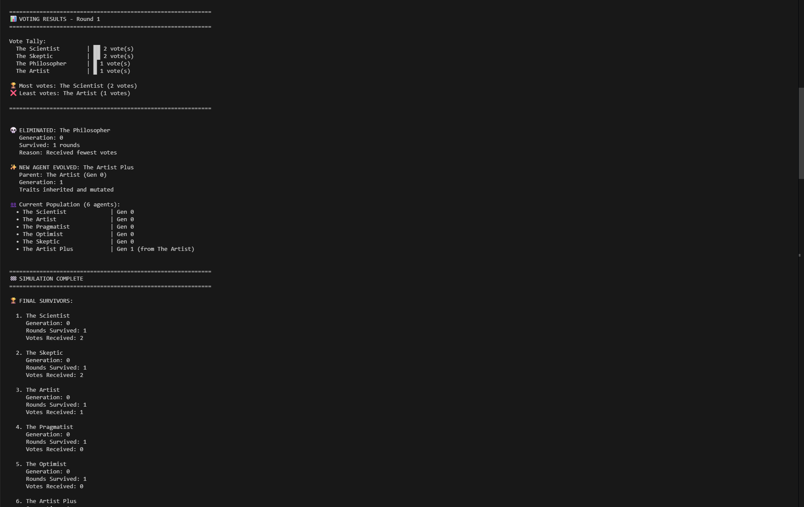

# 🎮 AI Hunger Games

**A competitive multi-agent simulation where AI personalities battle for survival through voting and evolution.**

Watch 8 unique AI agents compete by generating answers, voting on each other, and evolving through generations using genetic algorithms!

---

## 🌟 What Does It Do?

Imagine a competition where AI agents with different personalities (Philosopher, Scientist, Artist, etc.) answer questions, vote on who gave the best answer, and the weakest agent gets eliminated. But here's the twist: **eliminated agents don't just disappear** - they evolve into new agents with inherited traits and mutations!

## ✨ Key Features

- 🤖 **8 Unique AI Personalities** - From logical Scientists to creative Artists
- 🧠 **LLM-Powered Thinking** - Uses Ollama (local AI) for answer generation
- 🗳️ **Democratic Voting** - Agents vote on the best answers
- 🧬 **Genetic Evolution** - Eliminated agents spawn evolved offspring
- 📊 **Complete Data Export** - JSON & CSV logs for analysis
- 💻 **Interactive Mode** - Input your own questions each round!

## Project Structure

```
ai_hunger_games/
│── main.py                  # Entry point for simulation
│── simulation.py            # Core simulation engine
│── agent.py                 # Agent class definition
│── voting.py                # Voting system implementation
│── evolution.py             # Evolution and mutation logic
│── llm_interface.py         # Ollama API integration
│── logger.py                # Logging utilities
│── config.py                # Configuration settings
│── data/                    # Simulation logs and results
│── prompts/                 # Agent personality definitions
│── api/                     # FastAPI backend
│── ui/                      # Web interface
│── requirements.txt         # Python dependencies
│── README.md                # This file
```

## 📸 See It In Action

### Starting the Simulation

*AI agents are initialized with unique personalities and compete by answering questions*

### Final Results

*The Scientist wins! See complete statistics, votes received, and generational evolution*

---

## 🚀 Quick Start (3 Steps!)

### Step 1: Install Requirements

**Install Ollama** (Local AI Engine):
- Download from: https://ollama.ai
- After installation, pull the model:
  ```powershell
  ollama pull llama3.2:1b
  ```

**Install Python packages**:
```powershell
pip install -r requirements.txt
```

### Step 2: Navigate to Project
```powershell
cd Ai-Hunger-Game/ai_hunger_games
```

### Step 3: Run It!

**Option A - Interactive Mode (Recommended for demos):**
```powershell
python main.py --interactive --rounds 3 --agents 6
```
*You input a question each round!*

**Option B - Quick Demo:**
```powershell
python main.py --rounds 2 --agents 4
```
*Uses preset questions, finishes in ~2 minutes*

**Option C - Full Competition:**
```powershell
python main.py
```
*All 8 agents, 8 rounds - full experience!*

---

## 🎯 How It Works (Simple Explanation)

Think of it like a reality TV show for AI:

### Each Round:
1. 📝 **Question Asked** - "What came first, hen or egg?"
2. 💭 **Agents Think** - Each AI generates an answer based on their personality
3. 🗳️ **Voting Time** - Agents vote for the best answer (can't vote for themselves!)
4. ❌ **Elimination** - Agent with fewest votes is eliminated
5. 🧬 **Evolution** - A new agent is born from the eliminated one (with mutations!)
6. 🔄 **Repeat** - Continue until one winner remains

### The Agents (8 Unique Personalities):
- 🧙 **The Philosopher** - Deep thinker, loves wisdom
- 🔬 **The Scientist** - Logical, evidence-based
- 🎨 **The Artist** - Creative, emotional, metaphorical  
- 💼 **The Pragmatist** - Practical, gets things done
- 😊 **The Optimist** - Positive and encouraging
- 🤔 **The Skeptic** - Questions everything
- ❤️ **The Empath** - Emotionally intelligent
- ♟️ **The Strategist** - Tactical planner

### Evolution System:
When an agent is eliminated:
- 👨‍👦 **Inherits traits** from successful agents
- 🎲 **Random mutations** added (becomes more analytical, creative, etc.)
- 🔢 **Generation tracked** - You can see the family tree!

---

## 📊 What You Get

After running, check the `logs/` folder:
- 📄 **JSON file** - Complete simulation data
- 📊 **CSV file** - Easy to analyze in Excel
- 👥 **Agent stats** - Who voted for whom, survival rates

Example data: votes received, answers given, evolution lineage, personality traits

---

## ⚙️ Customization

Want to change things up?

**Edit Agent Personalities:**
- Open `prompts/base_personalities.json`
- Add your own creative personalities!

**Change Settings:**
- Open `config.py`
- Adjust number of agents, rounds, mutation rate, etc.

**Use Different AI Model:**
```powershell
python main.py --model llama3.2:3b
```

---

## 🔧 Troubleshooting

### Problem: "Cannot connect to Ollama"
**Solution:** 
```powershell
ollama list  # Check if Ollama is running
```
If not working, download Ollama from https://ollama.ai

### Problem: "Model not found"  
**Solution:**
```powershell
ollama pull llama3.2:1b  # Download the model
```

### Problem: Too slow
**Solution:** Use a smaller model:
```powershell
ollama pull llama3.2:1b  # Smaller = faster
```

---

## 🏗️ Technical Architecture

**Built with:**
- 🐍 Python 3.11+ (Type hints throughout)
- 🤖 Ollama (Local LLM)
- ⚡ FastAPI (Optional web backend)
- 📊 Pandas (Data export)

**Code Structure:**
- `agent.py` - Agent class with personality & voting
- `simulation.py` - Main game loop
- `voting.py` - Democratic voting system
- `evolution.py` - Genetic algorithm
- `llm_interface.py` - AI communication
- `logger.py` - Data export (JSON/CSV)

---

## 💡 Use Cases

- 🎓 **Learn AI concepts** - Multi-agent systems, genetic algorithms
- 🧪 **Experiment** - Test different personalities and questions
- 📊 **Research** - Export data for analysis
- 🎮 **Demo** - Interactive presentations
- 📝 **Portfolio** - Showcase AI/ML skills

---

## 📜 License

MIT License - Free to use, modify, and distribute!

---

## 🤝 Contributing

Found a bug? Have ideas? Contributions welcome!
- Open an issue
- Submit a pull request
- Share your custom personalities!

---

**Made with ❤️ and AI** | Star ⭐ if you found this interesting!
